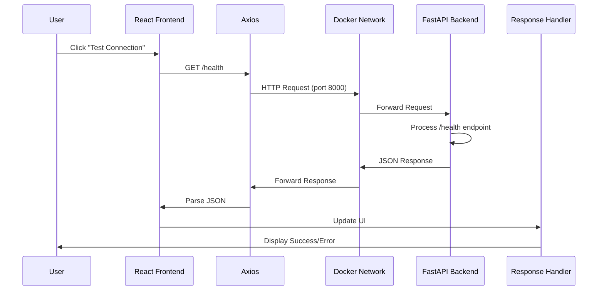

# Frontend-Backend Connection Test Documentation

## Overview

This document explains the connection test implemented in Phase 0.5 to verify frontend-backend integration. The test serves as a critical validation point before proceeding with full API development.

## Test Implementation

### 1. Backend Health Endpoint

**Location**: `/p2p-backend-app/app/main.py`

```python
@app.get("/health")
async def health_check():
    """Health check endpoint"""
    return {
        "status": "healthy",
        "service": "p2p-backend",
        "checks": {
            "api": "operational",
            # We'll add database checks later
        }
    }
```

**Purpose**: Provides a simple, lightweight endpoint that confirms the API is running and can respond to requests.

### 2. Frontend Connection Test Component

**Location**: `/p2p-frontend-app/src/components/ConnectionTest.tsx`

**Key Features**:
- Visual feedback for connection status
- Error handling and display
- Manual retry capability
- Color-coded status indicators

### 3. API Service Layer

**Location**: `/p2p-frontend-app/src/services/api.ts`

**Configuration**:
```typescript
const API_BASE_URL = import.meta.env.VITE_API_BASE_URL || 'http://localhost:8000';

export const apiClient: AxiosInstance = axios.create({
  baseURL: API_BASE_URL,
  timeout: 10000,
  headers: {
    'Content-Type': 'application/json',
  },
});
```

## What the Test Validates

### 1. Network Layer ✅
- **Cross-Origin Resource Sharing (CORS)**: Verifies that the backend allows requests from the frontend domain
- **Port Configuration**: Confirms frontend (5173) can reach backend (8000)
- **Docker Networking**: Validates that Docker containers are accessible from the host

### 2. Application Layer ✅
- **FastAPI Server**: Confirms the Python backend is running and serving requests
- **React Application**: Validates the frontend can make HTTP requests
- **Environment Variables**: Ensures configuration is properly loaded

### 3. Integration Points ✅
- **Axios Configuration**: Tests that the HTTP client is properly configured
- **React Query Setup**: Validates data fetching and state management
- **Error Handling**: Confirms error states are properly caught and displayed

## The Request/Response Flow



## Why This Test is Critical

### 1. **Foundation Validation**
Before building complex features, we must confirm the basic communication pipeline works. This test validates:
- Network connectivity
- Service availability
- Configuration correctness
- Library integration

### 2. **Early Problem Detection**
Common issues detected by this test:
- CORS misconfiguration
- Docker networking problems
- Port conflicts
- Environment variable issues
- Service startup failures

### 3. **Development Confidence**
A passing test means:
- ✅ All future API calls will use this proven pipeline
- ✅ Authentication can be built on this foundation
- ✅ Database connections can be added incrementally
- ✅ WebSocket connections will work (same network layer)

## Test Results Interpretation

### Success Response
```json
{
  "status": "healthy",
  "service": "p2p-backend",
  "checks": {
    "api": "operational"
  }
}
```
**Meaning**: Full stack is operational and ready for development

### Common Failure Scenarios

1. **Connection Refused**
   - **Cause**: Backend not running
   - **Fix**: Start Docker containers

2. **CORS Error**
   - **Cause**: Frontend domain not allowed
   - **Fix**: Update CORS configuration in backend

3. **Timeout**
   - **Cause**: Backend slow or unresponsive
   - **Fix**: Check Docker logs, resource usage

4. **404 Not Found**
   - **Cause**: Endpoint path incorrect
   - **Fix**: Verify API routes configuration

## Future Enhancements

As we progress through phases, this health check will be expanded to include:

```python
{
  "status": "healthy",
  "service": "p2p-backend",
  "checks": {
    "api": "operational",
    "database": {
      "postgresql": "connected",
      "mongodb": "connected"
    },
    "cache": {
      "redis": "connected"
    },
    "auth": {
      "supertokens": "connected"
    }
  }
}
```

## Removal Instructions

Once Phase 1 is complete and we have real API endpoints:

1. Remove `ConnectionTest.tsx` component
2. Remove the temporary test section from Dashboard
3. Keep the health endpoint for monitoring
4. Transition to using real API calls for validation

## Key Takeaways

1. **Simple tests provide maximum value** - A basic health check validates the entire infrastructure
2. **Visual feedback is important** - Users should see clear success/failure states
3. **Manual testing builds confidence** - Click-to-test allows developers to verify on demand
4. **Layer validation is critical** - Each layer of the stack must be verified independently

This connection test serves as the "Hello World" of full-stack integration, proving that all pieces can communicate before building complex features on top.